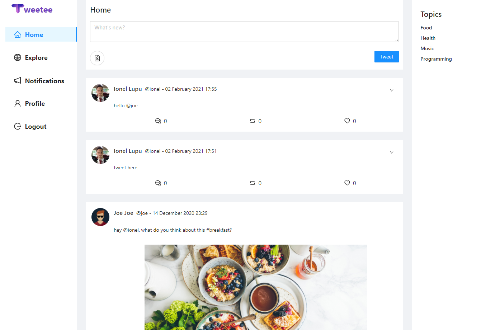

# Twitter clone app made with Typetron




This project was created as a result of going through
the [Twitter clone app tutorial](https://typetron.org/tutorials/twitter-clone/) presented on
the [Typetron](http://typetron.org/) website.

## Getting started

```shell script
npm install
npm start
```

```shell script
cd frontend
npm install
npm start
```

Open [http://localhost:4200](http://localhost:4200) to check the app.
